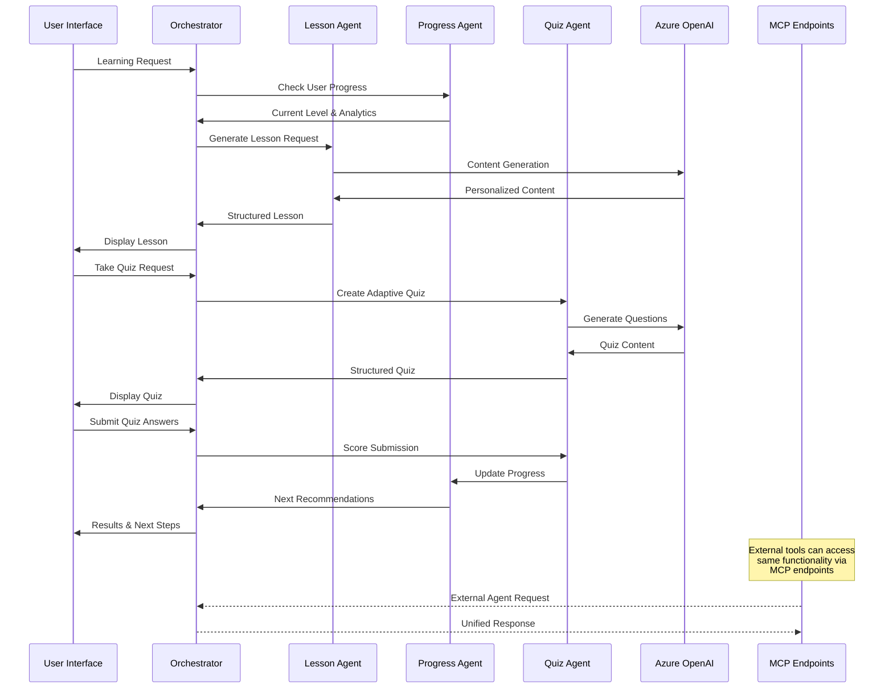

# 🌱 SkillSprout

SkillSprout is a personalized learning platform I built to make online education more engaging and effective. It creates bite-sized lessons (3-5 minutes) on any topic you choose, adapts to your learning style, and tracks your progress over time.

## 🎬 Demo

**SkillSprout in Action:**


*The demo shows the SkillSprout platform in action, highlighting how the MCP server endpoints integrate seamlessly with the Gradio interface, enabling personalized learning experiences through Model Context Protocol functionality.*

## 💡 What Makes SkillSprout Different

After trying dozens of online learning platforms, I noticed they all had the same problems - generic content, overwhelming lesson length, and no adaptation to how well you're doing. SkillSprout fixes these issues through a few key innovations:

### 🤖 **Smart Agent System**

Instead of a single AI model generating everything, SkillSprout uses multiple specialized AI agents that work together:

- **Lesson Agent**: Creates concise, personalized lessons on any topic you choose
- **Quiz Agent**: Builds quizzes that adapt to your performance and understanding
- **Progress Agent**: Tracks your learning patterns and adjusts difficulty accordingly
- **Orchestrator**: Coordinates everything behind the scenes

This multi-agent approach creates a much more personalized experience that feels like having a private tutor.

### 🔗 **Open Integration with MCP**

SkillSprout isn't a closed system. I built it using the Model Context Protocol (MCP) so it can:

- Connect with other learning tools through standard API endpoints
- Allow other apps to generate lessons or track learning progress
- Integrate with existing educational platforms and workflows

This means your learning progress isn't locked into just one platform.

### 🎯 **Core Features**

- **Quick Learning**: Lessons designed for busy people (3-5 minutes each)
- **Smart Difficulty**: System automatically adjusts as you improve
- **Learn Anything**: Works with standard skills or any custom topic you choose
- **Visual Progress**: Detailed analytics show your improvement over time

## 🏢 **Why I Built on Azure OpenAI**

I chose Azure OpenAI after experimenting with several AI platforms, for some practical reasons:

### 🛡️ **Reliability and Safety**
Education demands consistency. Azure OpenAI provides better content filtering and safety guardrails, which was crucial since this platform could be used in educational settings. I've also found it delivers more consistent results compared to other options I tested.

### � **Practical Considerations**
For anyone planning to use this in a professional setting, Azure's compliance certifications (SOC 2, GDPR, HIPAA) make it much easier to deploy in enterprise or educational environments. The platform also scales nicely as more users join.

### 🧩 **Balance of Control and Flexibility**
By combining Azure's managed services with open source tools like Gradio for the interface, I created something that's both reliable and customizable. This hybrid approach gives you consistent AI performance with a flexible, extendable front-end.

## ✨ Features

- 🎯 **Skill Selection**: Choose from predefined skills or enter custom topics
- 📚 **AI-Generated Micro-Lessons**: Concise, focused lessons (3-5 minutes)
- 🧠 **Adaptive Quizzes**: Smart quizzes that adjust difficulty based on performance
- 📊 **Progress Tracking**: Visual progress monitoring and analytics
- 🤖 **Agentic Architecture**: Multiple specialized AI agents working together
- 🔗 **MCP Integration**: Model Context Protocol endpoints for external integration
- 🎨 **Modern UI**: Clean, responsive Gradio interface
- 🎧 **Voice Narration**: AI-powered audio narration with Azure Speech Services
- 🏆 **Gamification System**: Achievements, points, levels, and progress rewards
- 🌟 **Enhanced Learning Experience**: Multi-modal learning with audio and visual feedback

### 🎧 Voice Narration System

SkillSprout includes an advanced **AI-powered voice narration system** that transforms text-based lessons into engaging audio experiences:

#### **🎤 Azure Speech Services Integration**
- **High-Quality Voices**: Powered by Azure Cognitive Services Speech SDK
- **Multi-language Support**: Neural voices supporting various languages and accents
- **Customizable Voice Selection**: Choose from different voice personalities
- **Natural Speech Synthesis**: Advanced SSML support for natural-sounding narration

#### **🎵 Voice Features**
- **Lesson Narration**: Convert any lesson content to professional audio
- **Adaptive Pacing**: Intelligent speech timing for optimal learning
- **Audio Export**: Download narration files for offline learning
- **Accessibility Support**: Screen reader compatibility and audio-first learning

#### **🔧 Voice Configuration**
```env
# Azure Speech Services Configuration (Optional)
AZURE_SPEECH_KEY="your-speech-api-key"
AZURE_SPEECH_REGION="eastus2"
AZURE_SPEECH_VOICE="en-US-AvaMultilingualNeural"
```

### 🏆 Gamification & Achievement System

SkillSprout incorporates a comprehensive **gamification system** to motivate learners and track progress:

#### **🎯 Achievement Categories**
- **🎯 First Steps**: Complete your first lesson
- **🧠 Quiz Master**: Score 100% on a quiz
- **💪 Persistent Learner**: Complete 5 lessons
- **🎓 Scholar**: Complete 10 lessons
- **⭐ Domain Expert**: Master a skill (20 lessons)
- **🌍 Polyglot**: Learn 3 different skills
- **💯 Perfectionist**: Score 100% on 5 quizzes
- **⚡ Speed Learner**: Complete lesson in under 3 minutes
- **📅 Consistent**: Learn for 7 days in a row
- **🎧 Explorer**: Try voice narration feature

#### **📊 Progress Metrics**
- **Points System**: Earn points for lessons, quizzes, and achievements
- **Level Progression**: Automatic level advancement based on activity
- **Mastery Tracking**: Skill-specific mastery percentage calculation
- **Streak Counters**: Daily learning streak tracking
- **Performance Analytics**: Detailed learning pattern insights

#### **🌟 Enhanced User Experience**
- **Real-time Notifications**: Instant achievement unlocks and progress updates
- **Visual Progress Indicators**: Progress bars, badges, and completion metrics
- **Personalized Recommendations**: AI-driven next steps based on progress patterns
- **Social Features**: Achievement sharing and progress visibility (optional)

## 🏗️ How It Works

When designing SkillSprout, I wanted to create something modular and maintainable while delivering a seamless experience to learners. Here's how it all comes together:

### Multi-Agent Architecture

Rather than creating a monolithic system, I separated functionality into specialized agents that each focus on what they do best:

#### 🧠 **Four Main Components**

1. **Lesson Agent**
   This component does the heavy lifting of creating personalized 3-5 minute lessons. It takes your skill request along with your current level and any previous lessons you've completed, then crafts content that's just right for your current knowledge. When designing this, I made sure it produces structured lessons with clear key concepts and practical examples.

2. **Quiz Agent** 
   Once you've read a lesson, this component creates quizzes that actually test understanding rather than just memorization. What I find particularly useful is how it adjusts difficulty based on your past performance. If you're consistently scoring high, it'll challenge you more; if you're struggling, it'll focus on reinforcing core concepts.

3. **Progress Agent**
   This was the trickiest part to get right. It tracks everything - which lessons you've completed, quiz scores, learning patterns - and uses that data to make smart recommendations about what to learn next and when to increase difficulty. I've found this creates a much more natural learning progression than static courses.

4. **Orchestrator**
   The central "brain" that coordinates everything. It manages the user session, handles any API failures gracefully, and connects the web interface with all the background processing.

#### 📂 **Code Organization**

The codebase is organized into three main files:

- **`space_app.py`** - The web interface and API endpoints
- **`app.py`** - All the core agent logic and data models
- **`run.py`** - Development and deployment utilities

#### 🔄 **How a Learning Session Works**



The system is built to be modular, so you can replace or upgrade individual components without breaking the whole application.

## 🚀 Quick Start

### Prerequisites

- **Python 3.10.16** installed
- Azure OpenAI subscription with API key
- Access to GPT-4 model deployment

### Installation

1. **Clone and navigate to the project:**
   ```powershell
   cd c:\Users\shyamsridhar\code\hf-hackathon
   ```

2. **Create and activate a virtual environment:**
   ```powershell
   python -m venv .venv
   .venv\Scripts\Activate
   ```
   *(On macOS/Linux, use `source .venv/bin/activate`)*

3. **Install dependencies:**
   ```powershell
   pip install -r requirements.txt
   ```

4. **Configure environment variables:**
   - Your `.env` file is already configured with Azure OpenAI credentials
   - Verify the credentials are correct and models are deployed

5. **Run the application:**
   ```powershell
   python run.py
   ```

   Choose from three options:
   - **Option 1**: Gradio App only (recommended for demo)
   - **Option 2**: MCP Server only
   - **Option 3**: Both services

## 🎯 Usage

### Learning Flow

1. **Select a Skill**: Choose from predefined skills or enter a custom topic
2. **Read the Lesson**: Engage with AI-generated micro-content
3. **Take the Quiz**: Test your understanding with adaptive questions
4. **View Results**: Get detailed feedback and progress updates
5. **Continue Learning**: Follow AI recommendations for next steps

### Available Skills

- Python Programming
- Spanish Language
- Public Speaking
- Data Science
- Machine Learning
- JavaScript
- Project Management
- Digital Marketing
- Creative Writing
- Photography

*Plus any custom skill you can imagine!*

## 🔗 API Integration

One feature I'm particularly proud of is the API system that lets other applications connect to SkillSprout. During development, I found that most learning platforms are closed systems, which limits their usefulness. I wanted to fix that:

### 🌐 **Available API Endpoints**

| Endpoint | Method | Description | Why It's Useful |
|----------|--------|-------------|----------|
| `/` | GET | Basic server info | Quick health checks |
| `/mcp/skills` | GET | Available skill suggestions | Discover what can be learned |
| `/mcp/lesson/generate` | POST | Create custom lessons | Generate learning content in other apps |
| `/mcp/progress/{user_id}` | GET | User learning stats | Track progress across platforms |
| `/mcp/quiz/submit` | POST | Submit and grade answers | Connect with testing systems |

### 📋 **Example Usage**

Want to generate a Python lesson for a beginner? It's as simple as:

```bash
POST /mcp/lesson/generate
{
  "skill": "Python Programming",
  "user_id": "learner_123",
  "difficulty": "beginner"
}
```

Or check someone's progress on a specific skill:

```bash
GET /mcp/progress/learner_123?skill=Python Programming
```

### 🔧 **Real-World Applications**

These APIs enable some interesting use cases:

- **LMS Integration**: Connect SkillSprout to existing learning management systems
- **Development Environments**: Imagine learning Python directly in VS Code when you need help
- **Progress Dashboards**: Build custom analytics that pull from SkillSprout's progress data

### 📖 **API Documentation**

For more detailed documentation, you can:
- Visit `http://localhost:8001/docs` when running locally
- Check the FastAPI auto-generated docs when deployed

## 📊 Progress Dashboard

Track your learning journey with enhanced analytics and gamification:

### 📈 **Learning Analytics**
- **Lessons Completed**: Number of lessons finished per skill
- **Quiz Performance**: Average scores and improvement trends  
- **Difficulty Progression**: Automatic difficulty adjustment tracking
- **Learning Streaks**: Consistent learning habit monitoring
- **AI Recommendations**: Personalized next steps and skill suggestions

### 🏆 **Gamification Tracking**
- **Achievement Progress**: Real-time achievement unlocking and badges
- **Points & Levels**: Experience points system with automatic level progression
- **Skill Mastery**: Detailed mastery percentage for each skill area
- **Performance Insights**: Learning velocity, accuracy trends, and engagement metrics
- **Goal Setting**: Personalized learning targets and milestone tracking

### 🎧 **Voice Learning Analytics**
- **Audio Engagement**: Voice narration usage patterns and preferences
- **Multi-modal Learning**: Balance between text and audio learning sessions
- **Accessibility Metrics**: Audio-first learning progress and completion rates

## 🔧 Configuration

### Environment Variables

The `.env` file contains your Azure OpenAI configuration:

```properties
# Azure OpenAI Configuration
AZURE_OPENAI_ENDPOINT="your-endpoint"
AZURE_OPENAI_KEY="your-api-key"
AZURE_OPENAI_API_VERSION="2024-12-01-preview"
AZURE_OPENAI_LLM_DEPLOYMENT="gpt-4.1"
AZURE_OPENAI_LLM_MODEL="gpt-4.1"

# Azure Speech Services (Optional - for voice narration)
AZURE_SPEECH_KEY="your-speech-api-key"
AZURE_SPEECH_REGION="eastus2"
AZURE_SPEECH_VOICE="en-US-AvaMultilingualNeural"
```

### Optional Settings

You can add these optional environment variables:

```properties
DEBUG=false
LOG_LEVEL=INFO
GRADIO_PORT=7860
MCP_PORT=8000
MAX_QUIZ_QUESTIONS=5
DEFAULT_LESSON_DURATION=5
```

## 🧪 Development

### Running in Development Mode

```powershell
# Install development dependencies
pip install -r requirements.txt

# Run with auto-reload
python app.py
```

### Testing MCP Endpoints

```bash
# Test lesson generation
curl -X POST "http://localhost:8000/lesson/generate" \
  -H "Content-Type: application/json" \
  -d '{"skill": "Python Programming", "user_id": "test_user"}'

# Get user progress
curl "http://localhost:8000/progress/test_user?skill=Python%20Programming"
```

## 📱 Deployment

### Local Deployment

```powershell
python run.py
```

### Hugging Face Spaces

1. Create a new Space on Hugging Face
2. Upload your code
3. Set environment variables in Space settings
4. The app will auto-deploy

### Azure App Service

1. Create an Azure App Service
2. Deploy using Git or ZIP
3. Configure environment variables
4. Set startup command: `python app.py`

## 🔍 Troubleshooting

### Common Issues

1. **Azure OpenAI Connection Error**
   - Verify your endpoint URL and API key
   - Check if your model deployment is active
   - Ensure you have sufficient quota

2. **Module Import Errors**
   - Activate your virtual environment
   - Install requirements: `pip install -r requirements.txt`

3. **Port Already in Use**
   - Change ports in environment variables
   - Kill existing processes: `netstat -ano | findstr :7860`

### Logs

Check application logs in `skillsprout.log` for detailed error information.

## 🏆 Key Platform Innovations

SkillSprout was developed as an innovative solution to showcase:

- **Intelligent Agent Coordination**: A network of specialized AI agents working together to create a cohesive learning experience
- **Azure OpenAI Integration**: Enterprise-grade AI capabilities with robust content filtering for educational contexts
- **Adaptive Learning System**: Difficulty adjustment based on learner performance and engagement patterns
- **Modern Interface Design**: Clean, responsive Gradio UI with intuitive navigation and visual feedback
- **Open Protocol Implementation**: Full Model Context Protocol (MCP) support for cross-platform integration
- **Comprehensive Progress Analytics**: Detailed learning metrics with visualization and recommendations
- **Resilient Architecture**: Robust error handling and graceful degradation when services are unavailable
- **Voice-Enhanced Learning**: Integrated audio narration capabilities through Azure Speech Services
- **Engagement-Focused Design**: Full gamification system with achievements, points, and progression mechanics
- **Multi-Modal Education**: Combined text, interactive, and audio-based learning pathways

I'm always open to feedback and collaboration. If you're interested in contributing or have ideas for improvement, please reach out.

**Happy Learning! 🎓**

## 📄 License

SkillSprout is released under the MIT License.

```
MIT License

Copyright (c) 2024 SkillSprout

Permission is hereby granted, free of charge, to any person obtaining a copy
of this software and associated documentation files (the "Software"), to deal
in the Software without restriction, including without limitation the rights
to use, copy, modify, merge, publish, distribute, sublicense, and/or sell
copies of the Software, and to permit persons to whom the Software is
furnished to do so, subject to the following conditions:

The above copyright notice and this permission notice shall be included in all
copies or substantial portions of the Software.

THE SOFTWARE IS PROVIDED "AS IS", WITHOUT WARRANTY OF ANY KIND, EXPRESS OR
IMPLIED, INCLUDING BUT NOT LIMITED TO THE WARRANTIES OF MERCHANTABILITY,
FITNESS FOR A PARTICULAR PURPOSE AND NONINFRINGEMENT. IN NO EVENT SHALL THE
AUTHORS OR COPYRIGHT HOLDERS BE LIABLE FOR ANY CLAIM, DAMAGES OR OTHER
LIABILITY, WHETHER IN AN ACTION OF CONTRACT, TORT OR OTHERWISE, ARISING FROM,
OUT OF OR IN CONNECTION WITH THE SOFTWARE OR THE USE OR OTHER DEALINGS IN THE
SOFTWARE.
```
