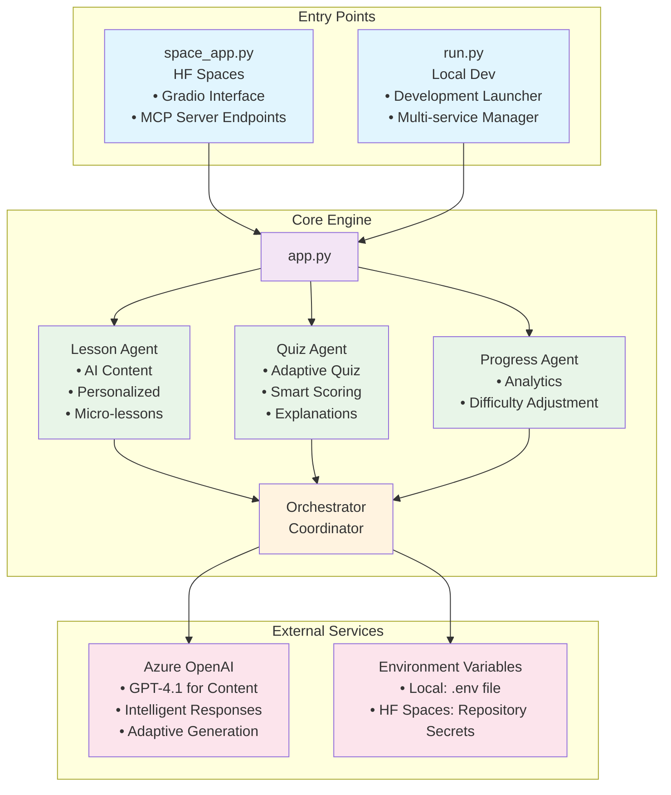
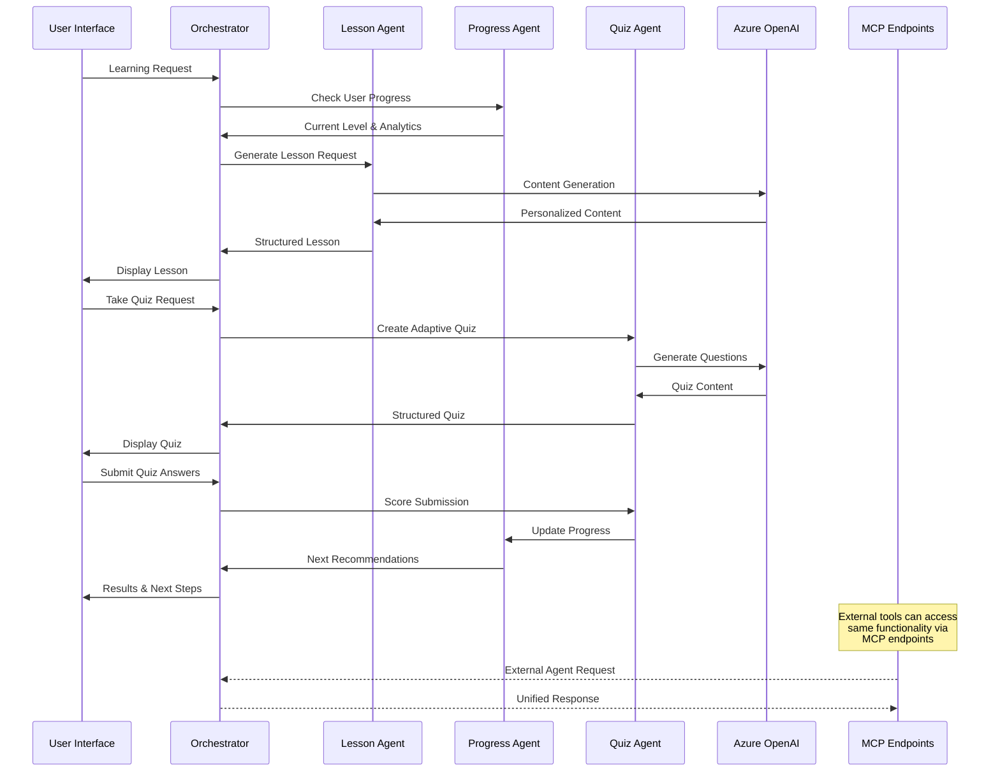

# 🌱 SkillSprout

**Tracks:** Track 1 (MCP Server/Tool) + Track 3 (Agentic Demo)

An AI-powered microlearning platform that leverages Azure OpenAI, Gradio, and Model Context Protocol (MCP) to deliver personalized bite-sized lessons and adaptive quizzes.

🎓 **Submitted for the Gradio Agents & MCP Hackathon 2025** 🚀

## 🎬 Demo Video

**MCP Server in Action:**

<video width="100%" controls loop preload="metadata">
  <source src="./assets/hf-hackathon.mp4" type="video/mp4">
  Your browser does not support the video tag. <a href="./assets/hf-hackathon.mp4">Download the demo video</a>
</video>

**🔊 Audio Troubleshooting:**
- **Volume Check**: Ensure your system volume is up and not muted
- **Browser Audio**: Check if your browser has audio enabled for this page
- **Direct Download**: [Click here to download and play the video locally](./assets/hf-hackathon.mp4)
- **Alternative View**: If embedded video has no sound, try opening the file directly in your browser

*Note: The video demonstrates the MCP server endpoints being used by various MCP clients, showcasing the seamless integration between the Gradio interface and Model Context Protocol functionality.*

## 🏆 Hackathon Highlights

This submission demonstrates several key innovations for the **Gradio Agents & MCP Hackathon 2025**, qualifying for **both Track 1 and Track 3**:

### 🔧 **Track 1: MCP Server/Tool**
- ✅ **Dual-Purpose Application**: Single app serving both Gradio interface AND MCP server
- ✅ **Full MCP Protocol Implementation**: Complete endpoints for lesson generation, progress tracking, and quiz submission
- ✅ **External Agent Integration**: Ready for use by Claude Desktop, Cursor, or any MCP client
- ✅ **Gradio-MCP Bridge**: Demonstrates how any Gradio app can also function as an MCP server

### 🤖 **Track 3: Agentic Demo Showcase**
- ✅ **Multi-Agent Architecture**: Specialized AI agents (Lesson, Quiz, Progress, Orchestrator) working in harmony
- ✅ **Intelligent Coordination**: Seamless agent interactions for personalized learning experiences
- ✅ **Adaptive Behavior**: AI agents that learn from user interactions and adjust accordingly
- ✅ **Real-world Application**: Production-ready agentic system for education and microlearning

### 🎯 **Dual Track Innovation**

**Why SkillSprout qualifies for both tracks:**

1. **Track 1 Compliance**: 
   - ✅ Gradio app that functions as a complete MCP server
   - ✅ All required MCP endpoints implemented (`/mcp/skills`, `/mcp/lesson/generate`, `/mcp/progress/{user_id}`, `/mcp/quiz/submit`)
   - ✅ Demonstrates MCP client integration capabilities
   - ✅ Tagged with "mcp-server-track" as required

2. **Track 3 Compliance**:
   - ✅ Showcases powerful AI agents working together (Lesson Agent, Quiz Agent, Progress Agent, Orchestrator)
   - ✅ Demonstrates real-world agentic application for education
   - ✅ Shows creative use of AI agents for personalized learning
   - ✅ Tagged with "agent-demo-track" as required

### 🧠 **Agentic Architecture Innovation**
- **🎓 Lesson Agent**: AI-powered content generation with Azure OpenAI
- **🧪 Quiz Agent**: Adaptive quiz creation based on lesson content and user performance  
- **📊 Progress Agent**: Smart difficulty adjustment and learning recommendations
- **🎯 Orchestrator**: Seamless coordination between all agents and user interactions

### 🔗 **MCP Endpoints Showcase**
- `GET /mcp/skills` - Discover available learning skills
- `POST /mcp/lesson/generate` - Generate personalized micro-lessons
- `GET /mcp/progress/{user_id}` - Access detailed learning analytics
- `POST /mcp/quiz/submit` - Submit and score quiz attempts

### 💡 **Unique Features**
- **Microlearning Focus**: 3-5 minute bite-sized lessons perfect for busy learners
- **Adaptive Difficulty**: AI automatically adjusts based on quiz performance
- **Any Skill Learning**: Works for both predefined and custom skills
- **Real-time Analytics**: Live progress tracking and personalized recommendations

## 🏢 **Enterprise Meets Open Source: Why Azure OpenAI?**

SkillSprout strategically leverages **Azure OpenAI** to bridge the gap between enterprise-grade reliability and open source innovation:

### 🛡️ **Enterprise-Grade Foundation**
- **🔒 Content Safety**: Built-in content filtering and safety guardrails for educational content
- **📊 Observability**: Comprehensive monitoring, logging, and analytics for production workloads
- **🔐 Security & Compliance**: Enterprise-level data protection and regulatory compliance (SOC 2, GDPR, HIPAA)
- **⚡ Performance**: Guaranteed SLAs, low latency, and scalable infrastructure
- **🌍 Global Availability**: Multi-region deployment options for worldwide accessibility

### 🚀 **Open Source Innovation**
- **🔗 Model Context Protocol**: Embracing open standards for agent interoperability
- **📖 Open Architecture**: Modular design that works with any MCP-compatible client
- **🎨 Gradio Integration**: Leveraging open source UI frameworks for rapid prototyping
- **🛠️ Extensible Design**: Easy to adapt, modify, and extend for different use cases
- **🤝 Community-Driven**: Contributing to the broader AI education ecosystem

### 💡 **Best of Both Worlds**
By choosing Azure OpenAI, SkillSprout delivers:
- **Production-Ready**: Enterprise controls meet innovative open source capabilities
- **Developer-Friendly**: Modern APIs with robust documentation and community support
- **Future-Proof**: Access to latest models while maintaining stability and governance
- **Educational Focus**: Content safety ensures appropriate learning materials for all audiences

This combination enables educational institutions, enterprises, and individual developers to confidently deploy AI-powered learning solutions at scale.

## ✨ Features

- 🎯 **Skill Selection**: Choose from predefined skills or enter custom topics
- 📚 **AI-Generated Micro-Lessons**: Concise, focused lessons (3-5 minutes)
- 🧠 **Adaptive Quizzes**: Smart quizzes that adjust difficulty based on performance
- 📊 **Progress Tracking**: Visual progress monitoring and analytics
- 🤖 **Agentic Architecture**: Multiple specialized AI agents working together
- 🔗 **MCP Integration**: Model Context Protocol endpoints for external integration
- 🎨 **Modern UI**: Clean, responsive Gradio interface
- 🎧 **Voice Narration**: AI-powered audio narration with Azure Speech Services
- 🏆 **Gamification System**: Achievements, points, levels, and progress rewards
- 🌟 **Enhanced Learning Experience**: Multi-modal learning with audio and visual feedback

### 🎧 Voice Narration System

SkillSprout includes an advanced **AI-powered voice narration system** that transforms text-based lessons into engaging audio experiences:

#### **🎤 Azure Speech Services Integration**
- **High-Quality Voices**: Powered by Azure Cognitive Services Speech SDK
- **Multi-language Support**: Neural voices supporting various languages and accents
- **Customizable Voice Selection**: Choose from different voice personalities
- **Natural Speech Synthesis**: Advanced SSML support for natural-sounding narration

#### **🎵 Voice Features**
- **Lesson Narration**: Convert any lesson content to professional audio
- **Adaptive Pacing**: Intelligent speech timing for optimal learning
- **Audio Export**: Download narration files for offline learning
- **Accessibility Support**: Screen reader compatibility and audio-first learning

#### **🔧 Voice Configuration**
```env
# Azure Speech Services Configuration (Optional)
AZURE_SPEECH_KEY="your-speech-api-key"
AZURE_SPEECH_REGION="eastus2"
AZURE_SPEECH_VOICE="en-US-AvaMultilingualNeural"
```

### 🏆 Gamification & Achievement System

SkillSprout incorporates a comprehensive **gamification system** to motivate learners and track progress:

#### **🎯 Achievement Categories**
- **🎯 First Steps**: Complete your first lesson
- **🧠 Quiz Master**: Score 100% on a quiz
- **💪 Persistent Learner**: Complete 5 lessons
- **🎓 Scholar**: Complete 10 lessons
- **⭐ Domain Expert**: Master a skill (20 lessons)
- **🌍 Polyglot**: Learn 3 different skills
- **💯 Perfectionist**: Score 100% on 5 quizzes
- **⚡ Speed Learner**: Complete lesson in under 3 minutes
- **📅 Consistent**: Learn for 7 days in a row
- **🎧 Explorer**: Try voice narration feature

#### **📊 Progress Metrics**
- **Points System**: Earn points for lessons, quizzes, and achievements
- **Level Progression**: Automatic level advancement based on activity
- **Mastery Tracking**: Skill-specific mastery percentage calculation
- **Streak Counters**: Daily learning streak tracking
- **Performance Analytics**: Detailed learning pattern insights

#### **🌟 Enhanced User Experience**
- **Real-time Notifications**: Instant achievement unlocks and progress updates
- **Visual Progress Indicators**: Progress bars, badges, and completion metrics
- **Personalized Recommendations**: AI-driven next steps based on progress patterns
- **Social Features**: Achievement sharing and progress visibility (optional)

## 🏗️ Architecture

### Multi-Agent System Design

The application implements a sophisticated **agentic architecture** where specialized AI agents collaborate to deliver personalized learning experiences:

#### 🧠 **Core Agents**

1. **🎓 Lesson Agent** (`LessonAgent` class)
   - **Purpose**: Generates personalized micro-lessons (3-5 minutes)
   - **AI Integration**: Uses Azure OpenAI GPT-4.1 for content creation
   - **Adaptive Logic**: Adjusts content based on user difficulty level and learning history
   - **Output**: Structured lessons with key concepts, examples, and practice exercises

2. **🧪 Quiz Agent** (`QuizAgent` class) 
   - **Purpose**: Creates adaptive quizzes based on lesson content
   - **Smart Features**: Adjusts question difficulty based on user performance
   - **Question Types**: Multiple choice, true/false, and open-ended questions
   - **Scoring**: Intelligent evaluation with detailed explanations

3. **📊 Progress Agent** (`ProgressAgent` class)
   - **Purpose**: Tracks learning progress and provides personalized recommendations
   - **Analytics**: Monitors completion rates, quiz scores, and learning patterns
   - **Adaptive Difficulty**: Automatically adjusts lesson difficulty based on performance
   - **Recommendations**: Suggests next learning steps and skill improvements

4. **🎯 Orchestrator** (`AgenticSkillBuilder` class)
   - **Purpose**: Coordinates all agent interactions and user workflow
   - **Session Management**: Handles user state and learning sessions
   - **Error Handling**: Robust fallback mechanisms for AI service failures
   - **Integration**: Bridges Gradio interface with MCP server endpoints

#### 🏛️ **System Architecture**



#### 🔗 **MCP Integration Architecture**

The application serves as both a **Gradio app** and **MCP server**, enabling external integrations:

```mermaid
graph TD
    subgraph "MCP Server Endpoints"
        A[GET /mcp/skills<br/>List available skills]
        B[POST /mcp/lesson/generate<br/>Generate personalized lessons]
        C[GET /mcp/progress/{user}<br/>Get learning analytics]
        D[POST /mcp/quiz/submit<br/>Submit quiz results]
    end
    
    subgraph "External MCP Clients"
        E[Claude Desktop]
        F[Cursor IDE]
        G[Custom Tools]
        H[Learning Dashboards]
        I[Educational Platforms]
    end
    
    A --> E
    A --> F
    A --> G
    B --> E
    B --> F
    B --> G
    C --> H
    C --> I
    D --> H
    D --> I
    
    style A fill:#e3f2fd
    style B fill:#e3f2fd
    style C fill:#e3f2fd
    style D fill:#e3f2fd
    style E fill:#f1f8e9
    style F fill:#f1f8e9
    style G fill:#f1f8e9
    style H fill:#fff8e1
    style I fill:#fff8e1
```

#### 📂 **File Structure**

- **`space_app.py`** - Primary entry point for Hugging Face Spaces
  - Unified Gradio interface + MCP server
  - FastAPI integration for MCP endpoints
  - Environment variable handling

- **`app.py`** - Core business logic and agent classes
  - All agent implementations
  - Data models (`UserProgress`, `Lesson`, `Quiz`)
  - Orchestration logic

- **`run.py`** - Local development launcher
  - Multi-service startup options
  - Development utilities

#### 🔄 **Agent Workflow**



This architecture ensures **scalability**, **modularity**, and **seamless integration** with external learning environments through the Model Context Protocol.

## 🚀 Quick Start

### Prerequisites

- **Python 3.10.16** installed
- Azure OpenAI subscription with API key
- Access to GPT-4 model deployment

### Installation

1. **Clone and navigate to the project:**
   ```powershell
   cd c:\Users\shyamsridhar\code\hf-hackathon
   ```

2. **Create and activate a virtual environment:**
   ```powershell
   python -m venv .venv
   .venv\Scripts\Activate
   ```
   *(On macOS/Linux, use `source .venv/bin/activate`)*

3. **Install dependencies:**
   ```powershell
   pip install -r requirements.txt
   ```

4. **Configure environment variables:**
   - Your `.env` file is already configured with Azure OpenAI credentials
   - Verify the credentials are correct and models are deployed

5. **Run the application:**
   ```powershell
   python run.py
   ```

   Choose from three options:
   - **Option 1**: Gradio App only (recommended for demo)
   - **Option 2**: MCP Server only
   - **Option 3**: Both services

## 🎯 Usage

### Learning Flow

1. **Select a Skill**: Choose from predefined skills or enter a custom topic
2. **Read the Lesson**: Engage with AI-generated micro-content
3. **Take the Quiz**: Test your understanding with adaptive questions
4. **View Results**: Get detailed feedback and progress updates
5. **Continue Learning**: Follow AI recommendations for next steps

### Available Skills

- Python Programming
- Spanish Language
- Public Speaking
- Data Science
- Machine Learning
- JavaScript
- Project Management
- Digital Marketing
- Creative Writing
- Photography

*Plus any custom skill you can imagine!*

## 🔗 MCP Endpoints

The application exposes **Model Context Protocol endpoints** for seamless integration with external tools and agents. These endpoints enable other applications to leverage our agentic learning system:

### 🌐 **Available Endpoints**

| Endpoint | Method | Description | Use Case |
|----------|--------|-------------|----------|
| `/` | GET | Server info & hackathon details | Health check & discovery |
| `/mcp/skills` | GET | List available predefined skills | Skill discovery for external agents |
| `/mcp/lesson/generate` | POST | Generate personalized lesson | Create content for learning platforms |
| `/mcp/progress/{user_id}` | GET | Get user learning analytics | Progress tracking in external systems |
| `/mcp/quiz/submit` | POST | Submit quiz answers | Assessment integration |

### 📋 **Request/Response Examples**

#### Generate Lesson
```bash
POST /mcp/lesson/generate
{
  "skill": "Python Programming",
  "user_id": "learner_123",
  "difficulty": "beginner"
}
```

#### Get Progress
```bash
GET /mcp/progress/learner_123?skill=Python Programming
```

### 🔧 **Integration Examples**

- **Claude Desktop**: Use our MCP endpoints as a learning assistant
- **Cursor IDE**: Integrate personalized tutorials into development workflow
- **Learning Management Systems**: Embed our AI-generated content
- **Educational Dashboards**: Pull progress analytics for reporting

### 📖 **API Documentation**

- **Local Development**: Visit `http://localhost:8001/docs` for interactive API docs
- **Hugging Face Spaces**: Visit your deployed space URL + `/docs`

### 🧪 **Testing MCP Integration**

```bash
# Test lesson generation
curl -X POST "https://your-space.hf.space/mcp/lesson/generate" \
  -H "Content-Type: application/json" \
  -d '{"skill": "Python Programming", "user_id": "test_user"}'

# Get user progress
curl "https://your-space.hf.space/mcp/progress/test_user?skill=Python%20Programming"
```

## 📊 Progress Dashboard

Track your learning journey with enhanced analytics and gamification:

### 📈 **Learning Analytics**
- **Lessons Completed**: Number of lessons finished per skill
- **Quiz Performance**: Average scores and improvement trends  
- **Difficulty Progression**: Automatic difficulty adjustment tracking
- **Learning Streaks**: Consistent learning habit monitoring
- **AI Recommendations**: Personalized next steps and skill suggestions

### 🏆 **Gamification Tracking**
- **Achievement Progress**: Real-time achievement unlocking and badges
- **Points & Levels**: Experience points system with automatic level progression
- **Skill Mastery**: Detailed mastery percentage for each skill area
- **Performance Insights**: Learning velocity, accuracy trends, and engagement metrics
- **Goal Setting**: Personalized learning targets and milestone tracking

### 🎧 **Voice Learning Analytics**
- **Audio Engagement**: Voice narration usage patterns and preferences
- **Multi-modal Learning**: Balance between text and audio learning sessions
- **Accessibility Metrics**: Audio-first learning progress and completion rates

## 🔧 Configuration

### Environment Variables

The `.env` file contains your Azure OpenAI configuration:

```properties
# Azure OpenAI Configuration
AZURE_OPENAI_ENDPOINT="your-endpoint"
AZURE_OPENAI_KEY="your-api-key"
AZURE_OPENAI_API_VERSION="2024-12-01-preview"
AZURE_OPENAI_LLM_DEPLOYMENT="gpt-4.1"
AZURE_OPENAI_LLM_MODEL="gpt-4.1"

# Azure Speech Services (Optional - for voice narration)
AZURE_SPEECH_KEY="your-speech-api-key"
AZURE_SPEECH_REGION="eastus2"
AZURE_SPEECH_VOICE="en-US-AvaMultilingualNeural"
```

### Optional Settings

You can add these optional environment variables:

```properties
DEBUG=false
LOG_LEVEL=INFO
GRADIO_PORT=7860
MCP_PORT=8000
MAX_QUIZ_QUESTIONS=5
DEFAULT_LESSON_DURATION=5
```

## 🧪 Development

### Running in Development Mode

```powershell
# Install development dependencies
pip install -r requirements.txt

# Run with auto-reload
python app.py
```

### Testing MCP Endpoints

```bash
# Test lesson generation
curl -X POST "http://localhost:8000/lesson/generate" \
  -H "Content-Type: application/json" \
  -d '{"skill": "Python Programming", "user_id": "test_user"}'

# Get user progress
curl "http://localhost:8000/progress/test_user?skill=Python%20Programming"
```

## 📱 Deployment

### Local Deployment

```powershell
python run.py
```

### Hugging Face Spaces

1. Create a new Space on Hugging Face
2. Upload your code
3. Set environment variables in Space settings
4. The app will auto-deploy

### Azure App Service

1. Create an Azure App Service
2. Deploy using Git or ZIP
3. Configure environment variables
4. Set startup command: `python app.py`

## 🔍 Troubleshooting

### Common Issues

1. **Azure OpenAI Connection Error**
   - Verify your endpoint URL and API key
   - Check if your model deployment is active
   - Ensure you have sufficient quota

2. **Module Import Errors**
   - Activate your virtual environment
   - Install requirements: `pip install -r requirements.txt`

3. **Port Already in Use**
   - Change ports in environment variables
   - Kill existing processes: `netstat -ano | findstr :7860`

### Logs

Check application logs in `skillsprout.log` for detailed error information.

## 📄 License

This project is part of a hackathon submission.

## 🏆 Hackathon Features

This implementation demonstrates:

- ✅ **Agentic Workflows**: Multiple AI agents collaborating
- ✅ **Azure OpenAI Integration**: Modern SDK usage with best practices
- ✅ **Adaptive Learning**: Smart difficulty adjustment
- ✅ **Modern UI**: Gradio-based responsive interface
- ✅ **MCP Protocol**: External agent integration capability
- ✅ **Progress Analytics**: Comprehensive learning tracking
- ✅ **Error Handling**: Robust error management and fallbacks
- ✅ **Voice Narration**: AI-powered audio synthesis with Azure Speech Services
- ✅ **Gamification System**: Achievements, points, levels, and user engagement
- ✅ **Multi-modal Learning**: Text, audio, and interactive experiences
- ✅ **Enhanced UX**: Real-time feedback, progress visualization, and personalized recommendations


**Happy Learning! 🎓**
